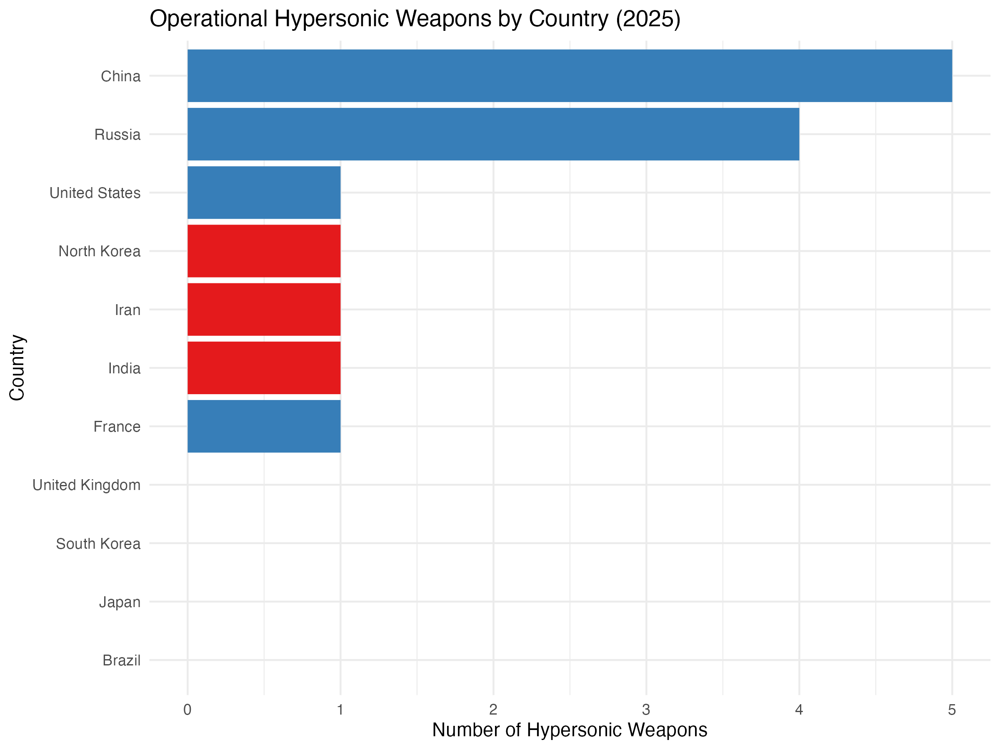

### Weapons Data

We provide the data and a code book of weapons by nation for critical data science instructional purposes.

# Hypersonic Weapons

| Variable Name        | Description                                                                  | Type      | Notes                                                                                  |
|---------------------|------------------------------------------------------------------------------|-----------|----------------------------------------------------------------------------------------|
| `nation`            | The name of the country.                                                     | Character | List of countries relevant to hypersonic and nuclear capabilities.                     |
| `hypersonic_weapons`| Number of completed/operational hypersonic weapons.                          | Numeric   | Only operational or near-operational systems as of 2025.                               |
| `un_status`         | Indicates if the country is a United Nations member.                         | Logical   | TRUE = UN member, FALSE = not a member.                                                |
| `pop25`             | Estimated population of the country in 2025.                                 | Numeric   | In persons, approximate.                                                               |
| `last_war`          | Name and date of the last war or major intervention the country fought.       | Character | Includes major wars and interventions, not minor skirmishes.                           |
| `last_war_n`        | The principal parties involved in the last war.                              | Character | Summarizes the main combatants.                                                        |
| `last_war_d`        | Date or period of the last war.                                              | Character | Year or range of years.                                                                |
| `count`             | The number of atomic bombs (nuclear warheads) owned by the country.           | Numeric   | Represents the total count of nuclear warheads as of 2025.                             |
| `host`              | Indicates whether the country hosts nuclear weapons from another nation.      | Numeric   | 1 = Hosts nuclear weapons, 0 = Does not host.                                          |
| `un`                | Rank of UN membership status.                                                | Numeric   | 2 = P5 member (UNSC Permanent), 1 = core member, 0 = non-core member.                  |
| `host_count`        | The number of nuclear bombs hosted by the country (if applicable).            | Numeric   | Number of foreign nuclear weapons hosted by the country.                               |

# The Atomic Bombs

The data includes various countries' nuclear capabilities and their hosting arrangements. The dataset also includes key variables that reflect the ownership of atomic bombs, hosting status, and membership in the United Nations Security Council. Understanding these variables is crucial for analyzing global nuclear dynamics and geopolitical relationships.

The data set includes five variables: `nation`, which identifies each country; `count`, representing the number of atomic bombs owned; `host`, indicating whether a country hosts nuclear weapons from another nation; `un`, denoting UN membership status; and `host_count`, which shows the number of nuclear bombs hosted by each country. Each variable is essential for understanding the landscape of nuclear armament and international relations.

| Variable Name | Description                                                              | Type        | Source         | Notes                                                                   |
|---------------|--------------------------------------------------------------------------|-------------|----------------|-------------------------------------------------------------------------|
| `nation`      | The name of the country.                                                 | Categorical |                | List of countries with nuclear capabilities or hosting arrangements.    |
| `count`       | The number of atomic bombs owned by the country.                         | Numeric     |                | Represents the total count of atomic bombs for each country.            |
| `host`        | Indicates whether the country hosts nuclear weapons from another nation. | Binary      |                | 1 = Hosts nuclear weapons, 0 = Does not host.                           |
| `un`          | Rank of UN membership status.                                            | Numeric     | [United Nations](https://www.un.org/en/about-us/member-states) | P5 members include Russia, US, China, France, UK. Codes: 2 for P5 members, 1 for members with core status, 0 for non-core status members.   |
| `host_count`  | The number of nuclear bombs hosted by the country (if applicable).       | Numeric     |                | Reflects the number of foreign nuclear weapons hosted by the country.   |

## Notes

- **P5 Members:** United States, Russia, China, France, United Kingdom (`un = 2`).
- **`hypersonic_weapons`:** Only includes operational or near-operational systems, not prototypes.
- **`count`:** Represents nuclear warhead inventory, not delivery systems.
- **`host` and `host_count`:** For these countries, typically 0; relevant for NATO nuclear sharing states.
- **`pop25`:** Rounded to nearest million for clarity.
- **Data Year:** All data as of 2025 unless otherwise noted.

### Data sources

- [Kurzgesagt](https://kurzgesagt.org/)

- [International Campaign to Abolish Nuclear Weapons](https://www.icanw.org/)

### Connections

The repository is called "bob" for those who know about Outkast's 2000 song "Bombs Over Baghdad."

This project helps frame a broader focus on state violence to highlight the intersection of societal attitudes toward violence, destruction, and various forms of aggression in relation to nations and power. The project aims to explore how historical precedents influence perceptions of violence and who is allowed to exercise power in today's world.

### Project members

Nathan Alexander (Howard), [critstats-users](https://professornaite.github.io/critstats/)

### cite

Quantitative Histories Workshop (2024). Nuclear Weapons Database, v1. Howard University, Washington, DC.