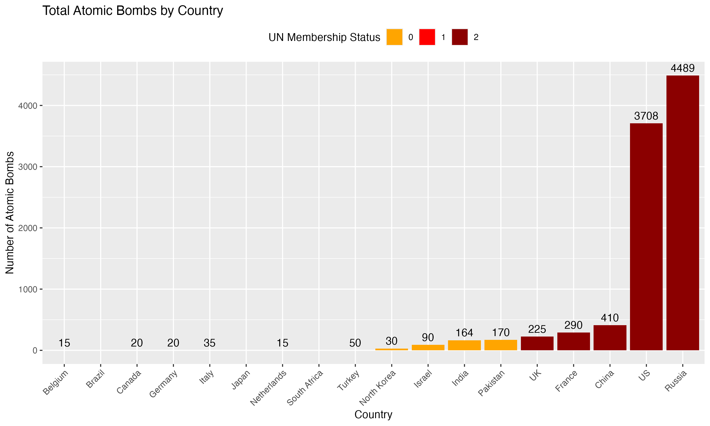

I provide the data and a code book for a Nuclear Weapons Dataset (NWD) The data includes various countries' nuclear capabilities and their hosting arrangements. The dataset also includes key variables that reflect the ownership of atomic bombs, hosting status, and membership in the United Nations Security Council. Understanding these variables is crucial for analyzing global nuclear dynamics and geopolitical relationships.

The dataset comprises several important variables: `nation`, which identifies each country; `count`, representing the number of atomic bombs owned; `host`, indicating whether a country hosts nuclear weapons from another nation; `un`, denoting UN membership status; and `host_count`, which shows the number of nuclear bombs hosted by each country. Each variable is essential for understanding the landscape of nuclear armament and international relations.

## Codebook

| Variable Name | Description                                                              | Type        | Source         | Notes                                                                   |
|---------------|--------------------------------------------------------------------------|-------------|----------------|-------------------------------------------------------------------------|
| `nation`      | The name of the country.                                                 | Categorical |                | List of countries with nuclear capabilities or hosting arrangements.    |
| `count`       | The number of atomic bombs owned by the country.                         | Numeric     |                | Represents the total count of atomic bombs for each country.            |
| `host`        | Indicates whether the country hosts nuclear weapons from another nation. | Binary      |                | 1 = Hosts nuclear weapons, 0 = Does not host.                           |
| `un`          | Rank of UN membership status.                                            | Numeric     | United Nations | G5 members include Russia, US, China, France, UK.   2 for G5 members, 1 for permanent members, 0 for non-permanent members.   |
| `host_count`  | The number of nuclear bombs hosted by the country (if applicable).       | Numeric     |                | Reflects the number of foreign nuclear weapons hosted by the country.   |

### Connections

The repository is called "bob" for those who know about Outkast's 1990 song "Bombs of Baghdad."

This project helps frame a broader focus on state violence to highlight the intersection of societal attitudes toward violence, destruction, and various forms of aggression in relation to nations and power. The project aims to explore how historical precedents influence perceptions of violence and who is allowed to exercise power in today's world.
